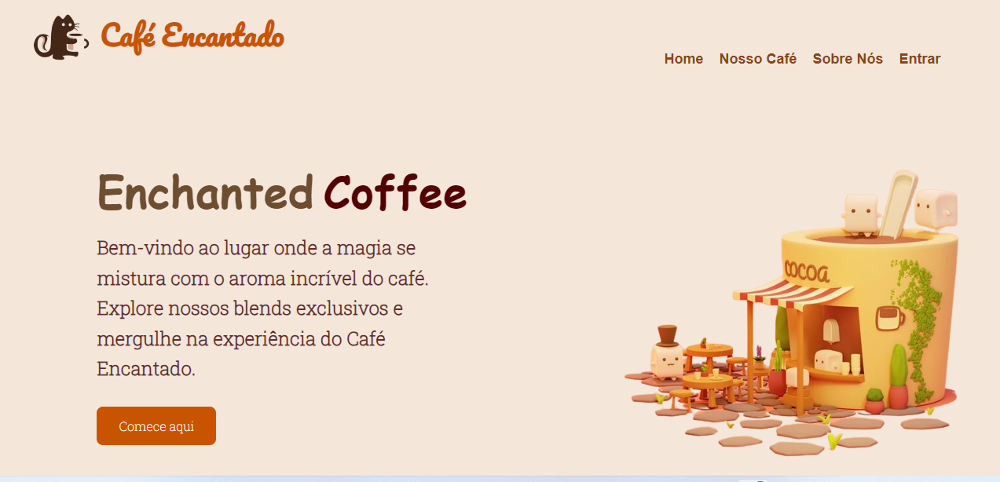

# Landing_Page
# Índice

[Enchanted Coffee](#enchanted-coffee)  
[Introdução](#introdu%C3%A7%C3%A3o)  
[Descrição](#descri%C3%A7%C3%A3o)  
[Sobre a Atividade](#sobre-a-atividade)
[Tecnologias ultilizadas ](#tecnologias-utilizadas)  
[Funcionalidade](#funcionalidade)  
[Fontes consultadas ](#fontes-consultadas)   
[Autores](#autores)  

#  Enchanted Coffee 🌟☕

## Introdução 
Este repositório contém o código-fonte de uma landing page para o Enchanted Coffee, um espaço online que proporciona uma experiência mágica ao redor do universo do café.

## Descrição
A landing page apresenta uma introdução ao Café Encantado, destacando seus blends exclusivos e convidando os visitantes a explorarem mais sobre a marca e sua proposta única. Ela oferece uma combinação de informações visuais e textuais para imergir os usuários na atmosfera encantadora do café.

## Sobre a Atividade

O professor Leonardo propôs a criação dessa Landing Page como parte de uma atividade de recuperação. O objetivo é desenvolver uma página web para a cafeteria na Saul Elkind, destacando seus diferenciais e atraindo potenciais clientes para conhecerem o estabelecimento.

## Tecnologias Utilizadas

[HTML](https://developer.mozilla.org/pt-BR/docs/Web/HTML) Estruturação da página.

[CSS](https://developer.mozilla.org/pt-BR/docs/Web/JavaScript): Estilização e layout da página.

[JavaScript](https://developer.mozilla.org/pt-BR/docs/Web/JavaScript) Adição de interatividade, 
como redirecionamento de páginas e modo escuro.

[Google Fonts](https://fonts.google.com/) Utilizadas para a tipografia da página.

[Font Awesome](https://fontawesome.com/) Biblioteca de ícones para elementos visuais.

## Funcionalidade 
``Navegação Intuitiva``: Barra de navegação com links para diferentes seções da página.

``Botão "Comece aqui"``: Redireciona para outra página.

``Modo Escuro``: Alternância entre modos de cor para personalização da experiência do usuário.

## Fontes consultadas 
[ChatGpt](https://chat.openai.com/)

## Autores 
``GABRIELLA INNOCENCIO GONCALVES DOS SANTOS``
